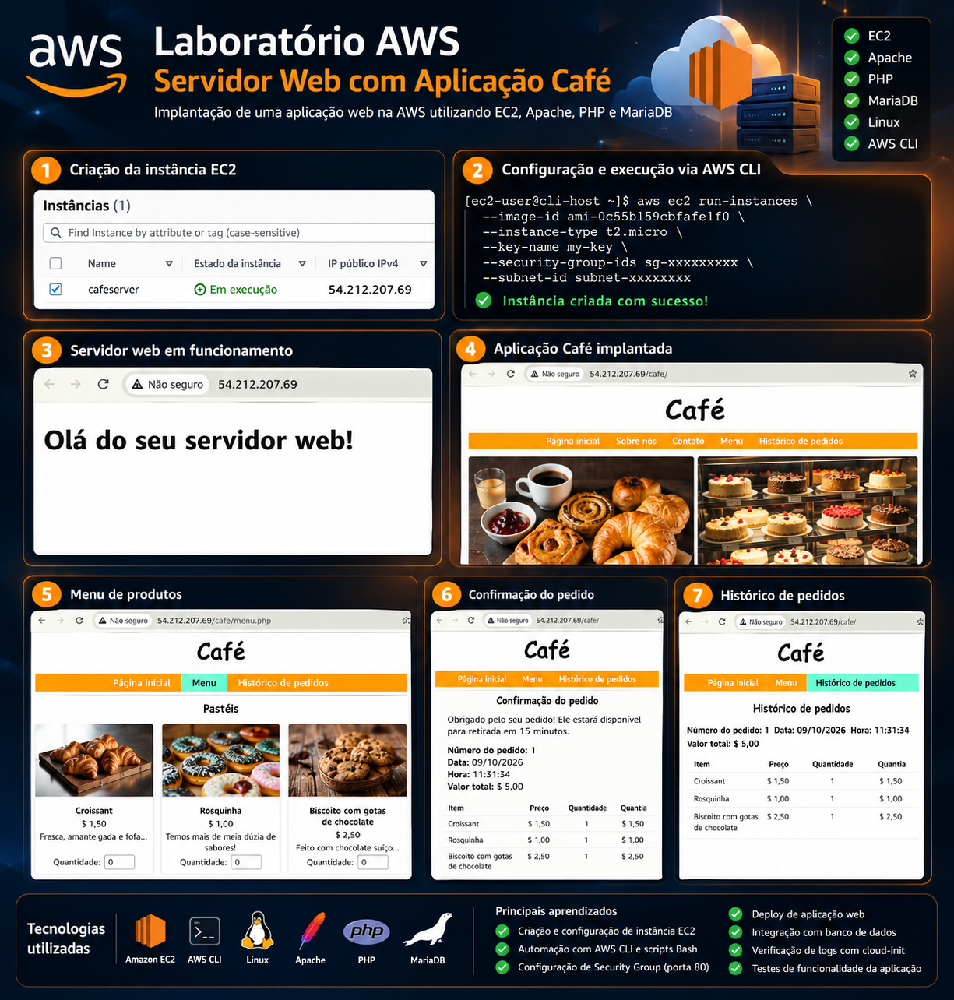
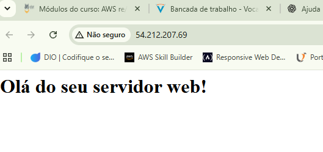
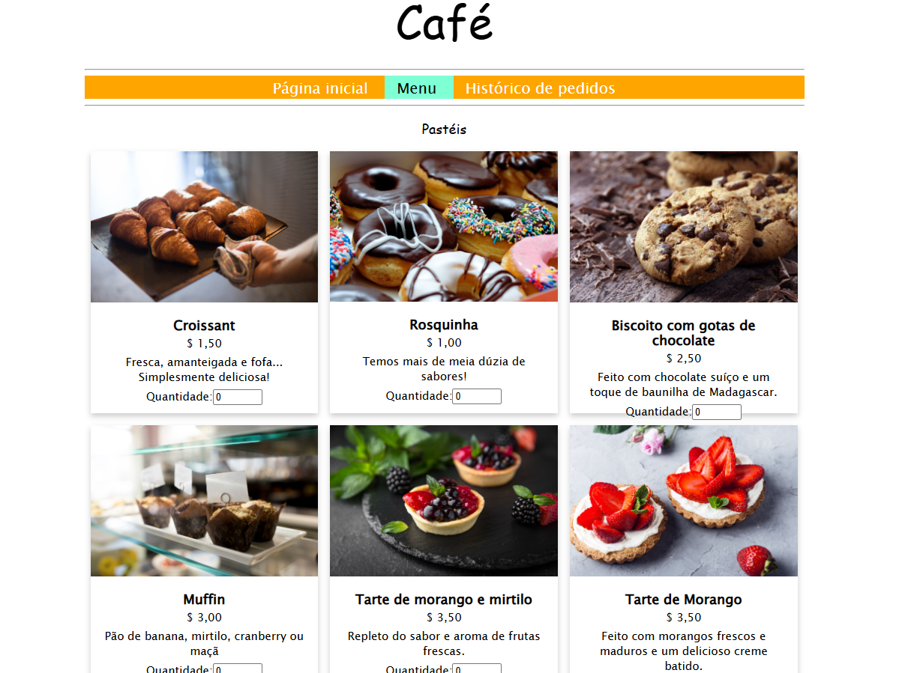
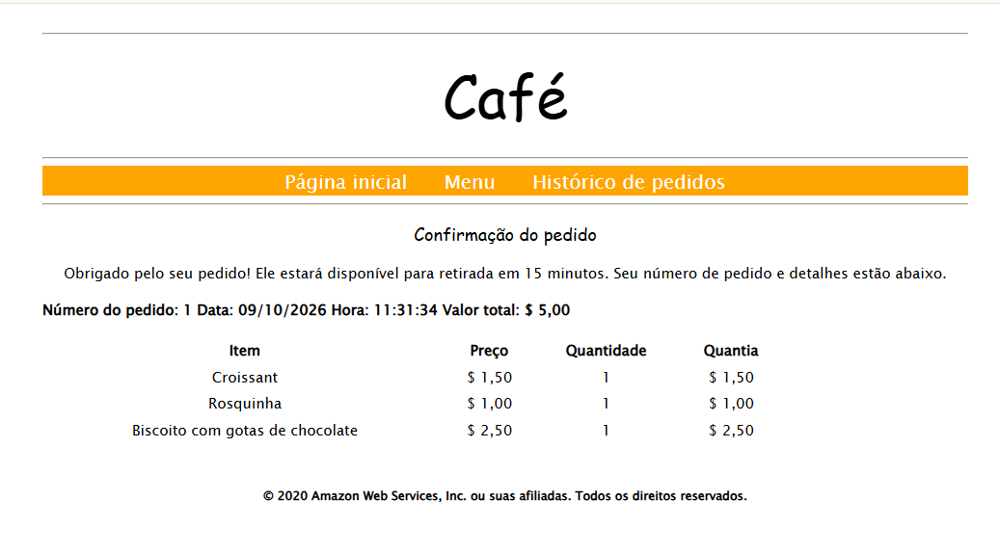

# ☁️ AWS EC2 — Servidor Web com Aplicação Café



## 📌 Sobre o projeto

Laboratório prático de Cloud Computing realizado em um ambiente educacional AWS.

O objetivo foi provisionar uma instância Amazon EC2 utilizando AWS CLI e scripts Bash, solucionar problemas de infraestrutura e disponibilizar uma aplicação web de cafeteria integrada a um banco de dados.

Durante o laboratório, foram identificados e corrigidos erros de configuração que impediam a criação da instância e o acesso ao servidor web.

## 🛠️ Tecnologias utilizadas

- Amazon Web Services (AWS)
- Amazon EC2
- AWS CLI
- Linux (Amazon Linux 2)
- Bash Shell Script
- Apache HTTP Server
- PHP
- MariaDB
- AWS Security Groups
- Cloud-init
- Nmap

## 🎯 Objetivos do laboratório

- Conectar a uma instância EC2.
- Configurar a AWS CLI.
- Analisar e executar um script Bash.
- Automatizar o provisionamento de recursos AWS.
- Investigar erros na criação de instâncias.
- Configurar regras de acesso HTTP e SSH.
- Implantar uma aplicação web.
- Verificar logs de inicialização.
- Testar a integração da aplicação com o banco de dados.

## 🚀 Etapas realizadas

### 1. Configuração da AWS CLI

Conexão à instância Host CLI utilizando EC2 Instance Connect.

Verificação da instalação da AWS CLI:

```bash
aws --version
```

Configuração do ambiente:

```bash
aws configure
```

Validação da autenticação:

```bash
aws sts get-caller-identity
```

### 2. Análise e execução do script Bash

Criação de uma cópia de segurança:

```bash
cp create-lamp-instance-v2.sh create-lamp-instance.backup
```

Análise do script responsável pelo provisionamento da infraestrutura.

Execução:

```bash
./create-lamp-instance-v2.sh
```

### 3. Correção de problemas na AWS

#### Problema 1 — AMI não encontrada

A criação da instância apresentou o erro:

```text
InvalidAMIID.NotFound
```

A investigação identificou uma inconsistência entre a região utilizada para consultar a AMI e a região definida no comando de criação da instância.

A região foi corrigida para `us-west-2`, permitindo a criação da instância EC2.

#### Problema 2 — Servidor web inacessível

Após a criação da instância, a aplicação não podia ser acessada pelo navegador.

Foi utilizado o Nmap para investigar a conectividade:

```bash
nmap -Pn -p 22,80 <IP-PUBLICO>
```

Resultado inicial:

```text
22/tcp open
80/tcp filtered
```

Foi identificado que o Security Group permitia acesso à porta 8080, enquanto o servidor Apache utilizava a porta 80.

A regra de entrada foi corrigida, permitindo o acesso HTTP.

### 4. Implantação da aplicação Café

A instância foi configurada com:

- Servidor Apache
- PHP
- Banco de dados MariaDB
- Arquivos da aplicação Café

O processo de inicialização foi acompanhado por meio dos logs:

```bash
sudo tail -n 60 /var/log/cloud-init-output.log
```

### 5. Testes da aplicação

Após a configuração da infraestrutura, foram realizados testes de funcionamento.

Funcionalidades verificadas:

- Acesso à página inicial
- Visualização do catálogo de produtos
- Consulta de preços
- Seleção de produtos e quantidades
- Envio e confirmação de pedidos
- Consulta ao histórico de pedidos

Os testes demonstraram a integração funcional da aplicação com o banco de dados.

## 📸 Evidências do laboratório

### Servidor web



### Aplicação Café



### Menu de produtos


### Confirmação do pedido



## 📚 Principais aprendizados

Este laboratório permitiu desenvolver habilidades práticas relacionadas a:

- Provisionamento de recursos na AWS.
- Automação de infraestrutura com AWS CLI e Bash.
- Diagnóstico de problemas de conectividade.
- Configuração de Security Groups.
- Administração básica de servidores Linux.
- Análise de logs com Cloud-init.
- Implantação de aplicações web.
- Integração entre aplicação e banco de dados.
- Troubleshooting em ambientes Cloud.

## 🔐 Segurança

Este repositório contém documentação e evidências do laboratório.

Credenciais de acesso, chaves privadas, senhas e outros dados sensíveis não devem ser publicados.

A infraestrutura utilizada pertence a um ambiente temporário de laboratório, portanto o endereço IP público pode deixar de funcionar após seu encerramento.

## 👨‍💻 Autor

**Thiago Volpolini**

Estudante de Análise e Desenvolvimento de Sistemas, com foco em Cloud Computing, Python, Análise de Dados e Desenvolvimento de Software.

- [GitHub](https://github.com/thiagovolpolini-art)
- [Portfólio](https://thiagovolpolini.com)

---

⭐ Projeto desenvolvido para fins educacionais e prática de infraestrutura em nuvem.
